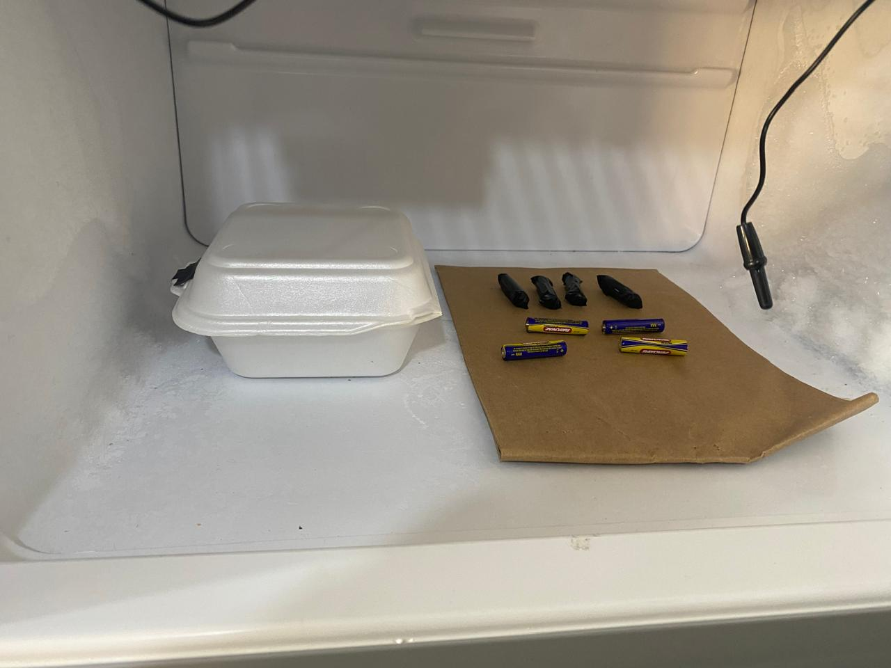

```{r load_libraries, results='hide', message=FALSE, warning=FALSE, echo=FALSE} 
library(ggplot2)
library(kableExtra)
library(dplyr)
library(pander)
options(scipen = 999)
```

# Introducción

El rendimiento y la vida útil de las baterías son aspectos críticos en una amplia variedad de dispositivos que utilizan baterías. La duración de una batería está influenciada por diversos factores, entre los cuales la temperatura y el uso de aislantes desempeñan un papel significativo en lugares con temperaturas bajas. En este experimento, se busca evaluar cómo diferentes temperaturas y tipos de aislantes afectan la vida útil de las baterías.

Un uso frecuente de la baterías en temperaturas bajas son los alpinistas que en las expediciones que realizan llevan baterías y las protegen de las baja temperatura utilizando aislantes caseros como son el plastaformo, cinta aislante, lana de vidrio y otros.

La temperatura es un factor determinante que puede acelerar o ralentizar las reacciones químicas dentro de una batería. Las temperaturas extremadamente bajas pueden causar una disminución en la capacidad de la batería y una mayor resistencia interna, lo que afecta su rendimiento. Por otro lado, los aislantes pueden proporcionar una protección adicional contra las variaciones de temperatura y otros factores ambientales, potencialmente mejorando la vida útil de las baterías.

Para investigar estos efectos, se diseñó un experimento en el que las baterías son sometidas a tres niveles de temperatura: -19°C, -17°C y -11°C. Además, cada batería se agrupa en uno de tres tipos de tratamiento de aislamiento: sin aislante, con aislante plastaformo y con cinta aislante. Este diseño factorial permite evaluar no solo el efecto individual de la temperatura y el tipo de aislante, sino también la interacción entre estos factores.

El objetivo principal del experimento es determinar cómo la combinación de diferentes temperaturas y tipos de aislantes influye en la vida útil de las baterías. Los resultados de este estudio proporcionarán información valiosa para optimizar el rendimiento y la durabilidad de las baterías en diversas condiciones operativas, contribuyendo a mejorar su eficiencia y fiabilidad en aplicaciones prácticas.


# Objetivos

## Objetivo Principal

Evaluar el efecto de diferentes temperaturas y tipos de aislantes en la vida útil de las baterías para identificar las condiciones óptimas que maximicen su duración y rendimiento.

## Objetivos Específicos

- Realizar el experimento y tomar las mediciones de la vida útil de las baterías expuestas a tres temperaturas así como también utilizando el aislante.

- Evaluar el Efecto de la Temperatura:   
    - Determinar cómo las temperaturas de -19°C, -17°C y -11°C influyen en la vida útil de las baterías.   
    - Identificar la temperatura óptima que maximiza la duración de las baterías. 

- Analizar el Impacto de Diferentes Aislantes:   
    - Comparar la efectividad de los tipos de aislantes (sin aislante, aislante plastaformo y cinta aislante) en la prolongación de la vida útil de las baterías.
    - Establecer cuál de los tipos de aislante proporciona la mejor protección y rendimiento para las baterías.

- Investigar la Interacción entre la Temperatura y el Tipo de Aislante:

- Proveer Recomendaciones para la Optimización del Uso de Baterías en Condiciones Extremas:

    - Basado en los resultados obtenidos, proporcionar recomendaciones prácticas para la utilización de baterías en diferentes condiciones de temperatura y con distintos tipos de aislantes.  
    - Contribuir al desarrollo de estrategias para mejorar la eficiencia y durabilidad de las baterías en aplicaciones reales.

- Generar datos y evidencia que puedan ser utilizados en futuros estudios y desarrollos en el campo de las baterías.
- Publicar los resultados y hallazgos del experimento para su revisión y utilización por la comunidad científica y la industria.

# Motivación

Tomando como motivación la necesidad de los alpinistas de conocer el efecto de la bajas temperaturas en la vida útil de las baterías las cuales son usadas por su cámara, linternas y otros dispositivos 

Uno de los desafíos más importantes es el efecto de las condiciones ambientales, especialmente la temperatura, en la eficiencia y vida útil de las baterías. Las temperaturas extremas pueden causar daños irreversibles y reducir significativamente el tiempo de funcionamiento de una batería, lo que limita su eficacia y aumenta los costos de reemplazo y mantenimiento. Además, el uso de materiales aislantes podría proporcionar una capa adicional de protección, mitigando algunos de los efectos adversos de las variaciones de temperatura.

Otra motivación es la validación de estudios sobre rendimiento de las baterías en condiciones extremas las cuales en promedio argumentan una disminución del 20% de la vida útil.

# Marco Teórico

- Durabilidad de las Baterías
La durabilidad y el rendimiento de las baterías son factores críticos que determinan su eficiencia y vida útil. Comprender los factores que afectan la vida útil de las baterías es crucial para mejorar su diseño y aplicación en diversas industrias.
La vida útil de la batería se mide en el tiempo que toma en descargarse la energía de forma aceptable.

- Factores que Afectan la Vida Útil de las Baterías
La vida útil de una batería está influenciada por múltiples factores, entre los cuales se destacan la temperatura y la protección contra factores ambientales. Estos factores afectan la química interna y la integridad física de las baterías, impactando directamente su capacidad para retener y suministrar energía.

    - Temperatura
La temperatura es uno de los factores más importantes que afectan el rendimiento de las baterías. Las reacciones químicas dentro de las baterías son altamente sensibles a la temperatura. A temperaturas bajas, la velocidad de las reacciones químicas disminuye, lo que puede aumentar la resistencia interna y reducir la capacidad de la batería. En contraste, temperaturas extremadamente altas pueden acelerar las reacciones, causando una rápida degradación de los materiales internos y acortando la vida útil de la batería.

    - Aislantes
El uso de aislantes puede proteger las baterías de los efectos adversos de las variaciones de temperatura y otros factores ambientales. Los aislantes como el plastaformo y la cinta aislante proporcionan una barrera física que puede ayudar a mantener una temperatura más constante alrededor de la batería, mitigando los efectos negativos del entorno. La elección del tipo de aislante puede tener un impacto significativo en la protección y el rendimiento de la batería.


- Variables del Estudio
Temperatura: Tres niveles (-19°C, -17°C, -11°C) que representan condiciones de temperatura extrema.
Tipo de Aislante: Tres tratamientos (sin aislante, aislante plastaformo, cinta aislante) para evaluar la protección adicional contra la temperatura.
Vida Util: Tiempo de duración de la batería luego de aplicar una temperatura y un tipo de aislante.

# Descripción de la base de datos

La base de datos fue creada con la medición de la vida útil en segundos de 36 pilas, expuestas a las combinaciones de 3 temperaturas y 3 tipo de aislantes.
A continuación el detalle los atributos:

|   |Variable            | Tipo de dato   | Descripción                                              |
|---|--------------------|----------------|----------------------------------------------------------|
|1  |id                  | Cuantitativo   | Identificador de la pila                                 |
|2  |dia	             | Cualitativo    | Cualitativo ordinal día de aplicación del tratamiento    |
|3  |tipoAislante	     | Cualitativo    | Valores "SinAislante", "Plastaformo", "CintaAislante"    |
|4  |temperatura	     | Cualitativo    | Grados centigrados (-19°C, -17°C, -11°C)                 |
|5  |tiempoAplicacion    | Cuantitativo   | Minutos aplicado el tratamiento                          |
|6  |vidaUtilHora        | Cuantitativo   | Vida Util de la pila en formato hora                     |
|7  |vidaUtil            | Cuantitativo   | Vida Util de la pila en segundos                         |

```{r db, echo=FALSE}
db <- read.csv("pilas.csv")
```

`r kbl(sample_n(db, 5)) %>% kable_styling(font_size = 12, latex_options = c("striped", "hold_position"))`

# Metodología

Para evaluar el efecto de la temperatura y el tipo de aislante en la vida útil de las baterías, se llevará a cabo un experimento de diseño factorial que contempla tres niveles de temperatura y tres tipos de aislamiento. La metodología detallada se describe a continuación:

1. Selección de la batería   
Se utiliza la pila AAA de 600 mA·h de un voltaje de 1.5v 

{width=150px} 

2. Instrumentos de  medición

    - Medición de la temperatura, se utilizo un termómetro de sonda con los parámetros técnicos 
        - Rango de medición: -50 °C + 70 °C 
        - Resolución: 0,1 °C
        - Precisión: 1 °C 
        - Fuente de alimentación: Batería de botón de 1,5 V

        {width=150px} 
        
    - Medición de la vida útil, se construyo un medidor de carga utilizando un arduino, el cual por medio de un display muestra el voltaje y tiempo de descarga de la pila, para acelerar la carga se utiliza un resistencia de 27 Ohm.
    El dispositivo descarga una pila AAA en un promedio de 35 Minutos, se considera descargado cuando la lectura en menos a 8.5 voltios.

      {width=300px} 

    - Congeladora domestica marca Consul, con 4 niveles de temperatura (-19°C, 17°C, -15°C, -11°C), la temperatura real varia de acuerdo a la hora del dia se tomo el promedio, cada tratamiento se empezo a medir a 5 de la tarde.


3. Diseño Factorial

$$y_{ijk} = \mu + \tau_i + \beta_j + (\tau \beta)_{ij}  + \epsilon_{ijk}  \quad i,j=1, \ldots, 3 \quad i,j=1, \ldots, n$$

- Temperatura:
    - -19°C
    - -17°C
    - -11°C
- Tipo de Aislante:
    - Sin aislante
    - Aislante plastaformo
    - Cinta aislante

4. Preparación de Muestras
Se seleccionarán baterías de la misma marca y modelo para garantizar la homogeneidad en las pruebas.
Las baterías se dividirán en 9 grupos, cada uno correspondiente a una combinación única de temperatura y tipo de aislante. Cada grupo constará 4 baterías para obtener resultados estadísticamente significativos.

{width=300px} 

5. Protocolo de Ensayo

- Aplicación de Aislantes: 
  Las baterías se prepararán aplicando los aislantes correspondientes a cada grupo:
    - Sin aislante: Baterías sin ninguna modificación.
    - Aislante plastaformo: Baterías recubiertas con plastaformo.
    - Cinta aislante: Baterías envueltas con 40cm de cinta aislante negro.

- Condiciones de Temperatura: 
  Las baterías se someterán a las temperaturas especificadas (-19°C, -17°C, y -11°C) utilizando el congelador, se empieza a las 5 de la tarde para minimizar el impacto del medio ambiente. 
  Cada combinación de aislante y temperatura se mantendrá durante 24 horas.

- Medición de la Vida Útil:  
La vida útil de cada batería se mide luego de sacar del congelador y esperar dos minutos de antes de utilizar el circuito medidor, posteriormente se registran los datos en la base de datos.

\
\
\
\
\
\

# Resultados y análisis

## Diseño Factorial

Preparamos los datos para el diseño factorial 

`r kbl(db) %>% kable_styling(font_size = 12, latex_options = c("striped", "hold_position"))`

## ANOVA

Ahora calculemos la ANOVA 

```{r echo=FALSE}
library(daewr)
pander(anova(aov(vidaUtil ~ tipoAislante * temperatura, data = db)))
```

Observamos que:  

- el tipo de aislante tiene un efecto significativo en la vida útil de la pila
- la temperatura tiene un efecto significativo en la vida útil de la pila
- la interacción de la temperatura y del tipo de aislante están cerca de tener un efecto significativo en la vida útil de la pila.

# Conclusiones y recomendaciones

Los resultados del experimento confirman que tanto la temperatura como el tipo de aislante son factores críticos que afectan la vida útil de las baterías. Además, existe una interacción significativa entre estos factores, lo que implica que la combinación óptima de temperatura y tipo de aislante depende de las condiciones específicas de operación.

- Temperatura Óptima:

Las baterías tienen un mejor rendimiento a -11°C en comparación con temperaturas más bajas, esta conclusión es basada en que los fabricantes especifican un mínimo de -20 C en condición regulares de rendimiento.

- Tipo de Aislante Óptimo:

El aislante plastaformo muestra la mayor efectividad en general, pero la cinta aislante también proporciona una mejora significativa.
Estos hallazgos proporcionan información valiosa para optimizar el rendimiento de las baterías en diversas condiciones ambientales, contribuyendo a su uso más eficiente y sostenible en aplicaciones prácticas. 

Se recomienda realizar realizar el experimento bajando mas la temperatura para observar mejor los efectos, debida a que muchas pilas están diseñadas para soportar temperaturas hasta -20 C.

Se recomienda realizar pruebas adicionales para evaluar otros tipos de aislantes y condiciones de temperatura más diversas. Esto permitirá obtener una comprensión más completa de los factores que afectan la vida útil de las baterías y desarrollar soluciones más efectivas.


# Referencias

- DOUGLAS C. MONTGOMERY 2017. "Design and Analysis of Experiments"
